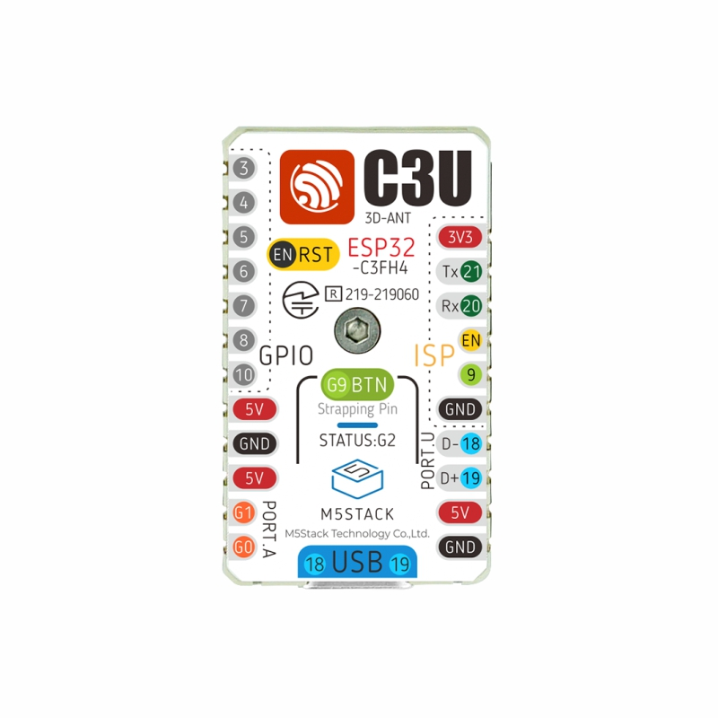

# C3U-Metal

Programming the ESP32-C3 on an **M5Stamp C3U** from the bare metal up. There is no operating system, no bootloader and no ESP-IDF framework: the chip's ROM jumps straight into our code. Everything after that is in this repository:

- the linker script and the C runtime startup
- the drivers
- a Lua interpreter you can type into over USB

It is meant for learning. Every file explains itself, the git history builds the project up one step at a time, and there are exercises for when you want to go further.



## What it does

Plug the board in, open its console and type Lua. It runs on the board straight away:

```lua
> led(0, 0, 40)                               -- the RGB LED turns blue
> for i = 1, 5 do led(40, 0, 0) delay(200) led(0, 0, 0) delay(200) end
> gpio.output(4) gpio.write(4, 1)             -- GPIO4 goes high
> mem()                                       -- how the RAM is being used
> help()                                      -- everything the board adds to Lua
```

## Hardware

- **M5Stack M5Stamp C3U** (SKU C122-B), an ESP32-C3 board. This project uses its button on **G9** and its SK6812 RGB LED on **G2**.
  - [Documentation and pinout](https://docs.m5stack.com/en/core/stamp_c3u)
  - Buy one: [M5Stamp C3U Mate with Pin Headers](https://shop.m5stack.com/products/m5stamp-c3u-mate-with-pin-headers) (SKU K122)
  - Buy five: [M5Stamp C3U (5 pcs)](https://shop.m5stack.com/products/m5stamp-c3u-5pcs)
- **A USB-C cable that carries data.** A charge-only cable powers the board, but it never shows up as a serial port.
- Optional, for the GPIO exercises: a breadboard, jumper wires, an LED and a 330 Ω resistor.

## Software

Everything comes with **ESP-IDF v6.0.1**, Espressif's development framework. C3U-Metal only uses its *tools*:

- the RISC-V GCC toolchain
- CMake and Ninja
- Python with pyserial and esptool
- OpenOCD and GDB

None of ESP-IDF's own code ends up on the board. Other ESP-IDF versions will probably work, but only v6.0.1 has been tested.

1. **Install ESP-IDF** by following Espressif's [Get Started guide](https://docs.espressif.com/projects/esp-idf/en/stable/esp32c3/get-started/index.html). It has instructions for Windows, macOS and Linux.
2. **Open a terminal with ESP-IDF's tools loaded.**
   - **Windows:** use the *ESP-IDF PowerShell* shortcut the installer creates.
   - **macOS and Linux:** run the activation command the installer gives you, for example `. $HOME/esp/esp-idf/export.sh`.
3. **Check the tools are there:**
   ```
   riscv32-esp-elf-gcc --version
   cmake --version
   python -c "import serial, esptool; print('ok')"
   ```
4. **Linux only:**
   - Allow your user to open the serial port with `sudo usermod -aG dialout $USER`, then log out and back in.
   - For debugging, also install OpenOCD's USB rules: `sudo cp $OPENOCD_SCRIPTS/../contrib/60-openocd.rules /etc/udev/rules.d/`
5. **Windows, and only for debugging:** if OpenOCD can't find the board, use [Zadig](https://zadig.akeo.ie) to install the WinUSB driver on the *USB JTAG/serial debug unit* interface. The serial port needs no driver.

Run every command below in that ESP-IDF terminal, in this folder.

## Build, flash and use it

```
cmake --preset default            # once: sets up the build folder
cmake --build build -t flash      # compile, link and write it to the board
python tools/monitor.py           # the Lua console; Ctrl-] quits
```

The first build also compiles Lua, so it takes a little longer. After that, only what changed is rebuilt. In the monitor, press Enter for a `>` prompt and type `help()`.

| Command | What it does |
|---|---|
| `cmake --build build` | Build only. `build/c3u-metal.elf` is for the debugger, `build/c3u-metal.bin` for the flash. |
| `python tools/selftest.py` | Types 15 checks into the console and reports PASS or FAIL. Leave GPIO4 unconnected. |
| `cmake --build build -t selftest` | Flash, then run the self-test. |
| `python tools/read_registers.py` | Pauses the CPU for a moment over JTAG and shows its registers. |

Any serial terminal works instead of `monitor.py`, for example PuTTY, MobaXterm or `screen`. The speed setting doesn't matter over USB. Close the terminal before flashing, because only one program can use the port at a time.

### In VS Code

Install the **C/C++** and **CMake Tools** extensions. Start VS Code from the ESP-IDF terminal (`code .`) so it can find the tools.

- **Terminal › Run Task** lists Configure, Build, Flash, Monitor, Self-test and Read registers.
- **Run › Start Debugging** (F5) flashes the board, starts OpenOCD and stops at `main()`. From there you can step through the code, set breakpoints and look at variables. OpenOCD keeps running afterwards: stop it in the terminal panel before you flash again.

## If something goes wrong

- **"M5Stamp C3U not found"**: try another cable, since many are charge-only. If it still isn't found, unplug the board and hold its button while you plug it back in. That starts the chip's ROM download mode, which works whatever program is on the board. Then flash again.
- **"Could not open port" or "port is busy"**: another program has the serial port open. Close the monitor or terminal.
- **Nothing appears in the monitor**: press Enter. The board only prints its prompt once a terminal is listening.
- **The board prints `*** CPU trap ...` and stops**: that is the crash report (see `app/trap_report.c`). It repeats every 5 seconds, so you still see it if you open the monitor after the crash.
  - `riscv32-esp-elf-addr2line -f -e build/c3u-metal.elf <address>` turns an address from the report into a function and line.
  - Unplug the board and plug it back in to restart it.
- **Build errors after moving or copying the folder**: delete the `build` folder and run `cmake --preset default` again.
- **Going back to ordinary ESP-IDF or Arduino programs**: just flash them. They put a bootloader back at the start of flash, replacing C3U-Metal.

## How to read it

| Folder | What's in it |
|---|---|
| `boot/` | `c3u-metal.ld` (where everything goes in memory), `crt0.S` (the first code that runs), stack checking |
| `chip/` | the ESP32-C3 itself: register addresses, `SystemInit()`, CPU helpers, the trap table |
| `board/` | `board.h`: the M5Stamp C3U's pins and CPU speed |
| `drivers/` | GPIO, the SK6812 LED, the USB console, uptime |
| `libc/` | `syscalls.c`: what newlib (the C library) needs from an operating system |
| `app/` | `main.c`, the Lua console (`repl.c`), Lua functions for the hardware and the system, the crash report |
| `third_party/lua/` | Lua 5.5.1, unmodified |
| `tools/` | Python scripts to flash, monitor, self-test and read registers |
| `docs/` | diagrams, the manual and the exercises |
| `solutions/` | worked solutions to the exercises |

A good order to read the code in:

1. `boot/c3u-metal.ld`: the memory map, and where each part of the program goes
2. `boot/crt0.S`: from the ROM's jump to `main()`
3. `chip/system_esp32c3.c` and `chip/esp32c3-regs.h`: watchdogs and the clock
4. `drivers/gpio.c`, then `drivers/sk6812.S`: pins, and LED pulses timed to 25 nanoseconds
5. `drivers/usb_serial.c` and `libc/syscalls.c`: how `printf` reaches your screen
6. `app/main.c`, `app/repl.c` and `app/lua_hw.c`: Lua and its console
7. `chip/trap.S` and `app/trap_report.c`: what happens when it crashes

Each source file starts with what it does, what to read first, and something to try.

The pictures are in `docs/`:
- [how it boots](docs/how-it-boots.md)
- [the memory map](docs/memory-map.md)
- [the USB console](docs/usb-console.md)

[docs/C3U-Metal-Manual.pdf](docs/C3U-Metal-Manual.pdf) goes through all of it chapter by chapter.

## The lessons in the history

The git history builds the project up in steps, and each step has a tag. You can go back to one to read it or build it:

| Tag | What it adds |
|---|---|
| `step-1-assembly` | Assembly only. The ROM jumps to our code, which turns off the watchdogs, speeds up the clock and lights the LED while the button is held. |
| `step-2-c-runtime` | Our own C runtime: a stack, `.data` and `.bss`, so the program can be written in C. |
| `step-3-cmsis-split` | Chip setup moves into `SystemInit()`, the way Arm's CMSIS does it. |
| `step-4-newlib-usb` | The newlib C library, `printf` over the built-in USB port, and code that runs from RAM. |
| `step-5-lua-repl` | Lua 5.5.1 and the interactive console. |

```
git checkout step-2-c-runtime                   # look around, build, flash
git diff step-1-assembly step-2-c-runtime       # exactly what that step changed
git checkout main                               # back to the latest version
```

Steps 1 to 5 date from before the CMake build. Each has its own `build.ps1`, a PowerShell script for Windows: run `.\build.ps1` from the ESP-IDF terminal to build and flash. On macOS or Linux, read the steps, or run the `riscv32-esp-elf-gcc` commands from that script by hand. `build.ps1` writes into the same `build` folder as CMake, so when you come back to `main`, delete `build` and run `cmake --preset default` again.

The tag `pre-cleanup` marks the same commit as `step-5-lua-repl`: the project as it was before it was reorganised into a teaching tool. The commits after step 5:
- sort the code into folders
- add the GPIO driver, the crash report and the CMake build
- add the documentation

## Exercises

[docs/exercises](docs/exercises/README.md) starts with warm-ups, such as rainbow colours and a pin of your own, and moves on to bigger projects:
- switching the CPU to 160 MHz
- a hardware timer and interrupts
- saving a Lua script to flash
- driving the LED with the RMT peripheral

Worked solutions are in [solutions](solutions/README.md). Have a go yourself first!

## Licences

- C3U-Metal's own code and documentation: MIT licence, see [LICENSE](LICENSE).
- `third_party/lua`: Lua 5.5.1, copyright © 1994–2026 Lua.org, PUC-Rio, MIT licence; see [third_party/README.md](third_party/README.md).
- `images/C122-B_02.jpg`: M5Stack's picture of the M5Stamp C3U, from their documentation. It belongs to M5Stack and is not covered by this project's licence.
