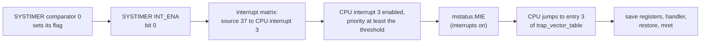

# Exercise 4: A timer interrupt

So far C3U-Metal does one thing at a time and never gets interrupted. An **interrupt** lets hardware stop the program for a moment, run a function called the *handler*, and then carry on exactly where it left off, as if nothing had happened.

**Goal:** make the SYSTIMER interrupt the CPU 1000 times a second. The handler counts, and a new Lua function `ticks()` returns the count.

## The path of an interrupt

An interrupt only reaches the handler if every gate along the way is open:

## 1. The SYSTIMER alarm

The SYSTIMER's counter unit 0 counts 16 000 000 times a second (see exercise 3). Comparator 0 can raise a flag every *period* counts. Set it up in this order, which is the order ESP-IDF uses:

| Step | Register | What to do |
|---|---|---|
| 1 | `CONF` `0x60023000` | set bit 31 (`CLK_EN`); clear bit 24 (`TARGET0_WORK_EN`) |
| 2 | `TARGET0_CONF` `0x60023034` | write the period in counts (16000 for 1 ms). Bit 31 = 0 picks counter unit 0. |
| 3 | `COMP0_LOAD` `0x60023050` | write 1 to apply the period |
| 4 | `CONF` | set bit 24 |
| 5 | `TARGET0_CONF` | set bit 30 (`PERIOD_MODE`): repeat, not just once |
| 6 | `INT_CLR` `0x6002306C`, `INT_ENA` `0x60023064` | write 1 to `INT_CLR`, then set bit 0 of `INT_ENA` |

## 2. The interrupt matrix

The chip has 62 interrupt sources, but the CPU has only 31 interrupt lines. The *interrupt matrix* (at `0x600C2000`) connects sources to lines:

| Register | Address | What to do |
|---|---|---|
| source map | `0x600C2000 + 4 × source` | the CPU interrupt number for that source; 0 means not connected. The SYSTIMER's comparator 0 is source 37. |
| `CPU_INT_TYPE` | `0x600C2108` | bit *n* = 0: CPU interrupt *n* is level-triggered (active while the flag is set) |
| `CPU_INT_PRI_n` | `0x600C2114 + 4 × n` | priority of CPU interrupt *n*: use 1 |
| `CPU_INT_THRESH` | `0x600C2194` | interrupts with a lower priority are ignored: use 1 |
| `CPU_INT_ENABLE` | `0x600C2104` | set bit *n* |

Use CPU interrupt 3. The ROM leaves some sources connected, so first write 0 to all 62 source map registers, the way ESP-IDF does.

## 3. The handler

In `chip/trap.S`, every entry of `trap_vector_table` jumps to `trap_entry`, the crash handler. Keep entry 0 for exceptions, and make entries 1 to 31 jump to a new `interrupt_entry`.

`interrupt_entry` must leave the interrupted program exactly as it was:
1. Make room on the stack (`addi sp, sp, -64`) and save every register a C function is allowed to change: `ra`, `t0`–`t6` and `a0`–`a7`. That is 16 registers × 4 bytes.
2. Call a C function. Pass it `mcause` so it knows which CPU interrupt this is: bit 31 is set, and the low 5 bits are the interrupt number.
3. Restore the registers and `sp`.
4. Return with **`mret`**, not `ret`. `mret` jumps back to `mepc` and turns interrupts back on. The CPU turned them off when it took the interrupt.

The C handler must **clear the SYSTIMER's flag** (write 1 to `INT_CLR`). Then it adds 1 to a counter. Declare the counter `volatile`, because the compiler must not assume it only changes where it can see.

## 4. Switch interrupts on, last

Bit 3 of the `mstatus` CSR, called MIE, lets interrupts through. C can't reach CSRs, so add two small functions to `chip/cpu.S`:
- `csrci mstatus, 8` switches interrupts off.
- `csrsi mstatus, 8` switches them on.

In exercise 1 you found that the ROM leaves MIE **on**. So in `main()`: switch interrupts off, set everything up, then switch them on.

## 5. Protect the LED's timing

An interrupt in the middle of an LED pulse stretches it, and the LED shows the wrong colour. At the start of `sk6812_send_grb` in `drivers/sk6812.S`, turn interrupts off and remember whether they were on: `csrrci a5, mstatus, 8` does both. At the end, turn them back on only if they were on before.

## 6. ticks()

Add `ticks()` to `app/lua_hw.c`, returning the counter.

## Check

- `a = ticks() delay(1000) print(ticks() - a)` prints about 1000.
- `for i = 1, 300 do led(0, i % 40, 0) end`, then `python tools/read_registers.py sk6812_last_high sk6812_last_bit` still shows about 17 and 51.
- `read_registers.py` shows `mepc` changing each time: it is where the last interrupt happened.
- `python tools/selftest.py` passes.

## When it goes wrong

- **The board stops responding as soon as interrupts go on.** The flag probably isn't cleared, so the interrupt fires again the moment `mret` returns (an "interrupt storm"). Flashing still works; fix it and flash again.
- **Random crashes later on.** A register isn't saved and restored, or `ret` is used instead of `mret`.
- **`ticks()` stays at 0.** One of the gates is still closed. Use `hex(peek(...))` to check each register in turn.
