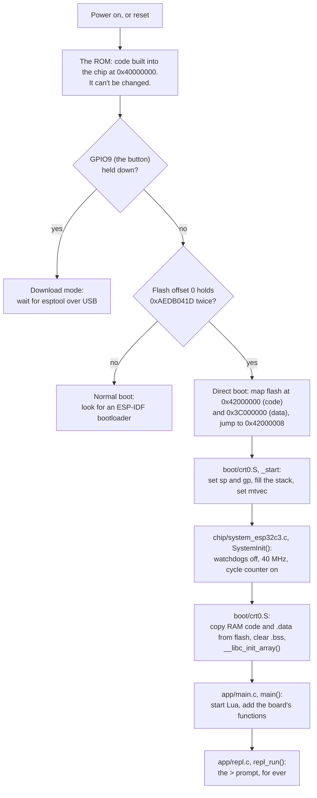

# How C3U-Metal boots

What happens between plugging in the board and the `>` prompt.



## The ROM

Every ESP32-C3 has a ROM, a program built into the silicon. After a reset it is the only code the chip knows about. It checks two things:

1. **Is GPIO9 low?** On the C3U that pin is the button. If the button is held, the ROM goes into *download mode* and waits for esptool to send a new program over USB. This is why holding the button while plugging in always lets you flash the board, whatever is on it.
2. **Does flash start with the direct-boot magic number?** `boot/c3u-metal.ld` puts `0xAEDB041D` twice at flash offset 0. When the ROM sees it, it maps the flash into the CPU's address space and jumps to address `0x42000008`. That address is our `_start`.

An ordinary ESP-IDF program is booted differently. The ROM loads a *second-stage bootloader* from flash, and the bootloader loads the application and starts FreeRTOS. C3U-Metal skips all of that.

## What the ROM leaves behind

When `_start` runs, almost nothing is ready:

| What | State | Who fixes it |
|---|---|---|
| Stack pointer `sp`, global pointer `gp` | whatever the ROM left in them | `crt0.S` step 1 |
| Trap vector `mtvec` | points into the ROM | `crt0.S` step 3 |
| Three watchdogs | **running**: they reset the chip unless someone stops or feeds them | `SystemInit()` |
| CPU clock | 20 MHz (the 40 MHz crystal divided by 2) | `SystemInit()` |
| RAM | leftovers: `.data` has no starting values and `.bss` isn't zero | `crt0.S` step 5 |

The order matters:
- `SystemInit()` is written in C, so it needs a stack first.
- It runs before `.data` and `.bss` are ready, so it must not use global variables.
- The watchdogs are stopped early, before anything slow happens.

## Following it with the debugger

Start a debug session in VS Code (F5). It stops at `main()`. To watch the boot from the very first instruction, type these into the Debug Console:

```
-exec monitor reset halt
-exec thbreak _start
-exec continue
```

Then step one instruction at a time and watch the registers change.
