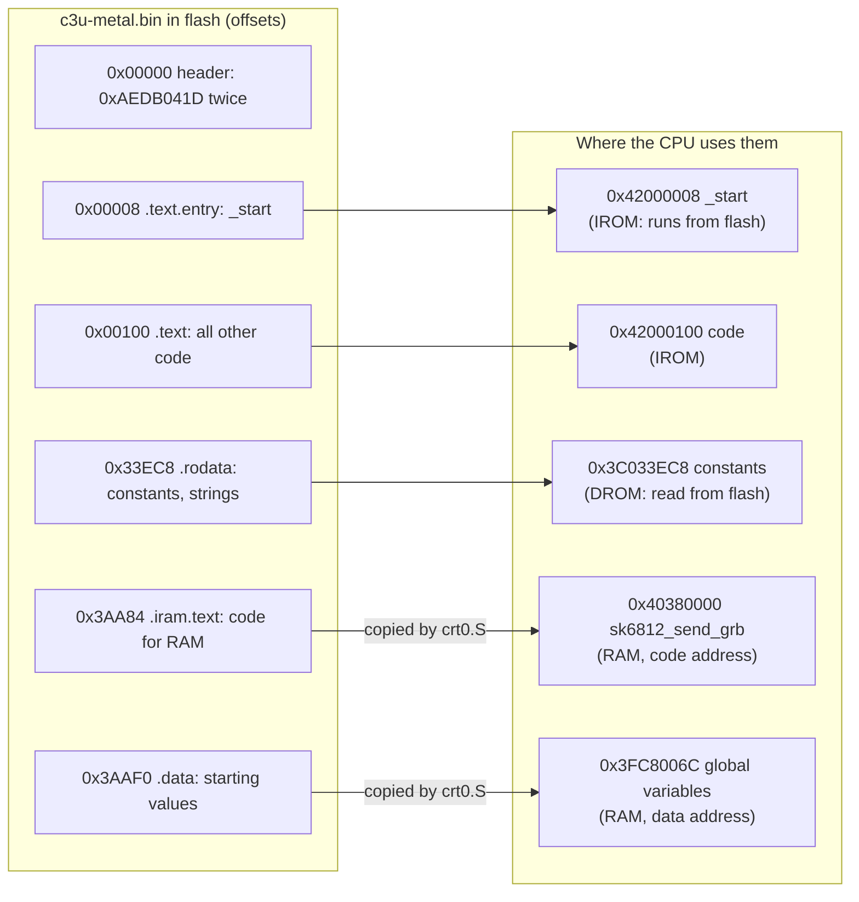

# The memory map

Where C3U-Metal's code and data live. The addresses below come from one build; yours move a little as the code changes. `build/c3u-metal.map` has the exact values.

## One flash chip, two views

The program is one file, `build/c3u-metal.bin`, written to flash from offset 0. In direct boot the ROM makes the first 4 MB of flash appear twice in the CPU's address space. Code is run through `0x42000000` (IROM) and data is read through `0x3C000000` (DROM). Sections that must be in RAM are stored in flash too, and `crt0.S` copies them across before `main()`.



## RAM

The ESP32-C3 has 400 KB of RAM. The ROM uses the top part, from `0x3FCD0000` up, so C3U-Metal takes the 320 KB below it:

```
0x3FCD0000  +--------------------------+  _stack_top
            |  stack (64 KB)           |  grows down; crt0.S fills it with STACK_FILL
0x3FCC0000  +--------------------------+  _stack_bottom = _heap_end
            |                          |
            |  heap (about 253 KB)     |  malloc() takes memory from the bottom up,
            |                          |  through _sbrk() in libc/syscalls.c
0x3FC80B88  +--------------------------+  _heap_start
            |  .bss                    |  global variables that start at 0
0x3FC80180  +--------------------------+
            |  .data                   |  global variables with a starting value
0x3FC8006C  +--------------------------+
            |  .iram.text              |  sk6812_send_grb, also visible at 0x40380000
0x3FC80000  +--------------------------+
```

Nothing stops the stack growing down into the heap. `boot/stack_check.c` can only tell afterwards, and `mem()` reports it.

## Why RAM has two addresses

The same RAM appears at `0x3FC80000` (the data bus) and at `0x40380000` (the instruction bus). They are exactly `0x700000` apart. The CPU can only run code from an instruction-bus address, but writes go through the data-bus address. So `crt0.S` copies `.iram.text` in through `0x3FC8xxxx`, and the code later runs at `0x4038xxxx`. In `c3u-metal.ld` this is `IRAM_TO_DRAM`.

`sk6812_send_grb` runs from RAM because code in flash can pause for a moment while the flash cache loads it. A pause in the middle of an LED pulse would change the colour.

## The global pointer

`gp` holds `__global_pointer$` (here `0x3FC8086C`). GCC can reach any variable within 2 KB of `gp` with a single instruction, so small variables go in `.sdata` and `.sbss`, near it. `crt0.S` sets `gp` with linker relaxation turned off. Otherwise the linker would rewrite the instruction that sets `gp` to use `gp`, which has no value yet.

## Seeing it for yourself

```
riscv32-esp-elf-objdump -h build/c3u-metal.elf         # every section: address, size, flash offset
riscv32-esp-elf-nm -n build/c3u-metal.elf | more       # every symbol, in address order
```

At the console, `hex(peek(0x42000000))` reads the magic number back through the IROM view. `mem()` shows how the heap and stack are being used.
