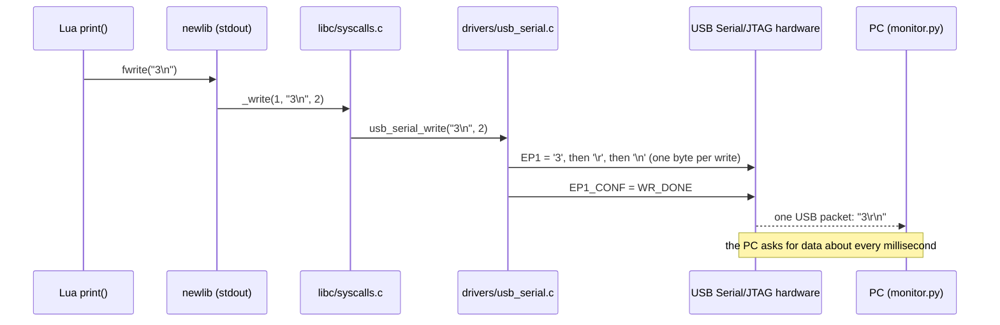
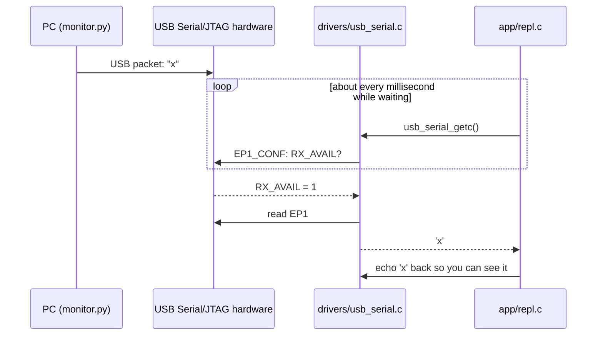

# The USB console

The ESP32-C3 has USB built in. Its *USB Serial/JTAG* peripheral makes the board appear on the PC as two things at once:
- a serial port (COM11, `/dev/ttyACM0`, ...)
- a JTAG debug adapter

That needs no extra chip and no driver code, and it works whatever program is running. `drivers/usb_serial.c` talks to the serial side with three registers.

## From print() to your screen

- Each write to the `EP1` register adds one byte to a 64-byte buffer in the hardware.
- Writing `WR_DONE` to `EP1_CONF` sends what's in the buffer as one USB packet.
- When the buffer is full, the hardware sends it by itself.
- `usb_serial_write()` turns each `\n` into `\r\n`, because terminals expect both.

## From your keyboard to Lua

Nothing interrupts the program when a key arrives: the console polls. While Lua code runs, the REPL checks for Ctrl-C every 1000 Lua instructions, and keeps any other keys for the next line. Exercise 4 replaces the polling with a USB interrupt.

## Two details that took some debugging

**Exactly 64 bytes.** USB ends a transfer with a packet that is *shorter* than the maximum, 64 bytes here. A full 64-byte packet tells the PC that more is coming, so the PC may wait. After a full packet, `usb_serial_flush()` therefore sends an empty one, with `WR_DONE` and nothing in the buffer, to say "that's all".

**Nobody listening.** With no terminal open, the PC never collects packets. The send buffer stays full, and a program waiting for room would wait for ever. `usb_serial.c` waits at most 50 ms. After a timeout it stops waiting altogether, dropping output, until the buffer has room again. That is why the start-up banner is lost if no terminal is open: press Enter for a fresh prompt.

## DTR and RTS

A serial port has two control lines, DTR and RTS. On boards with a separate USB-serial chip they are wired to the ESP32's reset and boot pins, and esptool wiggles them to reset the chip. The USB Serial/JTAG peripheral copies this behaviour, so a terminal that changes DTR or RTS can reset the board. `tools/board.py` opens the port with both off, which leaves the running program alone.
