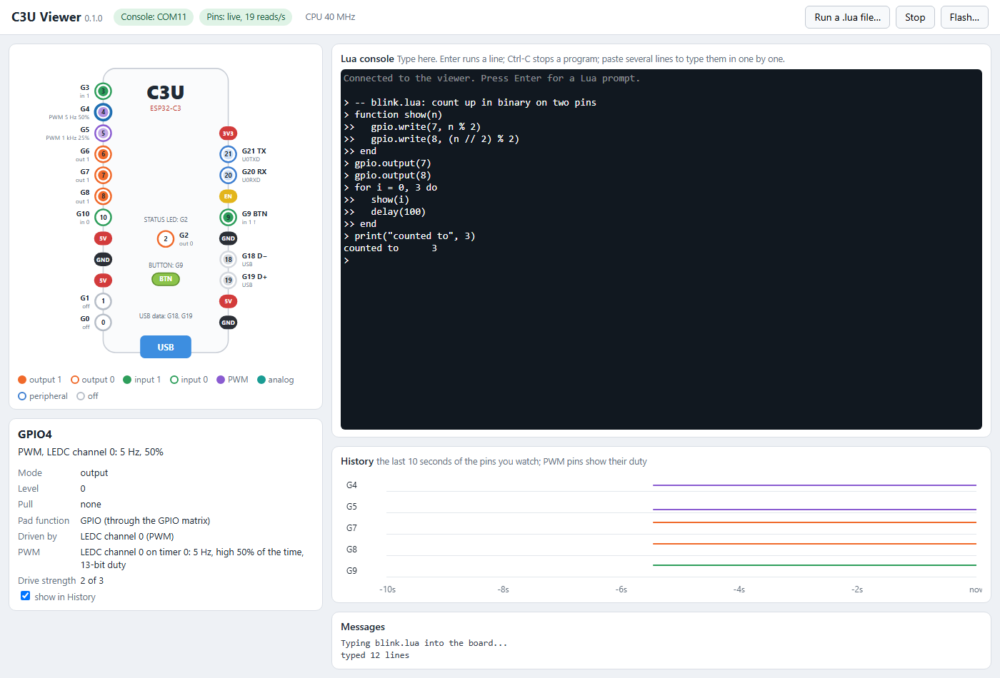

# C3U Viewer

Watch an M5Stamp C3U's pins change while your Lua program runs, and type Lua to it, all in a web browser. It needs nothing but the board's USB cable.



- **The board picture** shows every pin where it is on the M5Stamp C3U, coloured by what it is doing: an output set to 1 or 0, an input reading 1 or 0, PWM, analog, a peripheral, or nothing. It updates about 20 times a second.
- **Click a pin** to see everything about it: its level, its pull resistors, what drives it ("LEDC channel 0 (PWM): 5 Hz, 50%"), and which peripheral inputs it feeds.
- **History** draws the last 10 seconds of the pins you choose. A pin your program makes an output, or gives PWM, is added by itself.
- **The Lua console** is the board's own prompt. Enter runs a line, Ctrl-C stops a program, and pasting several lines types them in one at a time.
- **Run a .lua file** types a program you wrote in an editor into the board, line by line.
- **Flash** puts C3U-Metal back on a board, or writes any other `.bin` file.

The viewer reads the pins without stopping your program. It was measured: a Lua loop does exactly the same amount of work with the viewer reading 1200 registers a second as with nothing reading at all.

## Starting it

Download the program from the [Releases page](https://github.com/BitSwizzlerio/M5Stamp-C3U-Metal/releases): `c3u-viewer-windows-x64.exe` for Windows, `c3u-viewer-linux-x64` for Linux.

**Windows:** double-click `c3u-viewer-windows-x64.exe`. A small window opens (keep it open; closing it stops the viewer), then your browser opens the viewer. The first time, Windows SmartScreen may say it "protected your PC", because the program isn't signed: choose **More info**, then **Run anyway**.

**Linux:** in a terminal:

```
chmod +x c3u-viewer-linux-x64
./c3u-viewer-linux-x64
```

It needs a Linux at least as new as Ubuntu 22.04 or Debian 12, on a 64-bit PC.

Plug the board in, before or after: the viewer finds it either way, and finds it again if it is unplugged or restarts.

## The first time on a computer

**Windows** already has a driver for the board's console, so the console works straight away. Reading the pins uses the board's other USB function, JTAG. Windows gives that a generic driver by itself, but it lacks one setting that OpenOCD needs to find the board, so the pins stay blank until Espressif's driver replaces it. A yellow banner says so: click **Install the driver** and answer **Yes** when Windows asks for permission. That's once per computer, and it needs an administrator. Computers that have had ESP-IDF installed already have the driver.

The viewer downloads the driver package from Espressif (`idf-driver-esp32-usb-jtag-2021-07-15.zip`) and checks it before installing. On a computer without internet, put that zip file next to `c3u-viewer.exe` and the viewer uses it instead.

**Linux** needs permission to use the board without root. The yellow banner shows one command, with a **Copy** button. Run it once in a terminal, then unplug the board and plug it back in. The same rule tells ModemManager, which many desktop Linuxes run, to leave the board alone: it otherwise opens new USB serial devices to look for modems, which can reset the board and scramble the console.

## For teachers

- A board flashed with C3U-Metal is all a student needs, together with this program. They don't need ESP-IDF, Python or any other tools.
- A board that has been broken, or reflashed with something else, can be put back with **Flash…**, which carries C3U-Metal inside it. If a board doesn't answer at all, hold its button while plugging it in (download mode), then flash.
- **Erase the whole flash first** in the Flash dialog also removes a Lua script saved with `save()` from exercise 7. That's useful if a saved script crashes the board every time it starts.
- For a classroom without internet, copy the driver zip (see above) next to the program on each computer, or install the driver once from an administrator account.

## If something goes wrong

| What you see | What to do |
|---|---|
| **Console: board not found** | Check the cable; many USB cables only carry power. |
| **Console: port in use by another program** | Close the other serial monitor, terminal or Arduino IDE. The pins still work. |
| **Pins: Board not found on JTAG** | Close any debugger (OpenOCD, VS Code's Run and Debug) that may be using the board. |
| **Pins: The USB driver for the board's JTAG interface isn't installed** | Use the banner's **Install the driver** button. |
| The page says the viewer program has stopped | Start the program again, then reload the page. |
| Anything else | Click **Diagnostics**, then **Copy**, and send the text to whoever looks after the viewer. |
| Typing does nothing | Click in the console first. Press Enter for a `>` prompt. |

## How it works

The ESP32-C3's USB port is two things at once: a serial port, which carries the Lua console, and a JTAG debug port. The viewer runs [OpenOCD](https://github.com/espressif/openocd-esp32) in the background and uses it only to read memory over the chip's system bus. In that mode the debug module reads the bus itself, and the CPU never stops. The viewer reads:

- `GPIO_IN`, `GPIO_OUT` and `GPIO_ENABLE`, for each pin's level and whether it is an output;
- `IO_MUX_GPIOn`, for each pad's function, pull resistors and drive strength;
- the GPIO matrix (`GPIO_FUNCn_OUT_SEL_CFG`, `GPIO_FUNCm_IN_SEL_CFG`), for which peripheral drives a pin or reads it;
- the LEDC registers, for PWM frequency and duty, and the ADC's last result, but only while those peripherals are switched on.

Every register on that list is safe to read: reading it changes nothing. The decoding is in `c3uview/chip.py`, which says where each bit is.

## Running it from source, and building it

From this folder, with Python 3.10 or newer:

```
python -m venv .venv
.venv/Scripts/python -m pip install -r requirements.txt     # on Linux: .venv/bin/python
.venv/Scripts/python c3u_viewer.py
```

Run from source, it uses OpenOCD from an ESP-IDF installation, or the one named by the `C3U_OPENOCD` environment variable. It flashes `build/c3u-metal.bin` from the project.

To make the single-file program, build C3U-Metal first (`cmake --build build`), then:

```
.venv/Scripts/python -m pip install pyinstaller
.venv/Scripts/python build.py
```

This makes `dist/c3u-viewer.exe` on Windows and `dist/c3u-viewer` on Linux; WSL works for the Linux one. `build.py` downloads Espressif's OpenOCD for that system, checks it against the release's published checksums, and puts it inside the program, together with C3U-Metal and the licences of everything it carries (also copied to `dist/licenses`).

### Making a release

`.github/workflows/viewer-release.yml` builds both programs on GitHub's own machines and publishes them. Set the new version in `c3uview/__init__.py`, commit, then:

```
git tag viewer-v0.1.0
git push origin viewer-v0.1.0
```

The workflow builds C3U-Metal's firmware with Espressif's RISC-V toolchain, then the viewer on Windows and on Ubuntu 22.04, then publishes a release with `c3u-viewer-windows-x64.exe`, `c3u-viewer-linux-x64` and `c3u-viewer-licenses.zip`. It stops if the tag doesn't match the version. **Run workflow** on the Actions page builds the programs without publishing anything.

| File | What it does |
|---|---|
| `c3u_viewer.py` | starts everything and opens the browser |
| `c3uview/chip.py` | which registers to read, and what their bits mean |
| `c3uview/jtag.py` | runs OpenOCD and reads memory through it |
| `c3uview/console.py` | the Lua console over the serial port |
| `c3uview/flasher.py` | flashing, with esptool |
| `c3uview/computer_setup.py` | the Windows driver and the Linux udev rule |
| `c3uview/server.py` | the local web server the page talks to |
| `c3uview/web/` | the page: board picture, pin details, history, console |
| `c3uview/signals.py` | the chip's signal and pad-function names, generated from ESP-IDF |

## Licences

C3U Viewer is part of C3U-Metal (MIT licence). The program also carries OpenOCD (GPL-2.0-or-later) unchanged, as a separate program, plus esptool (GPL-2.0-or-later), pyserial (BSD) and xterm.js (MIT). Their licences and where to get their source are in `licenses/` next to the program.
